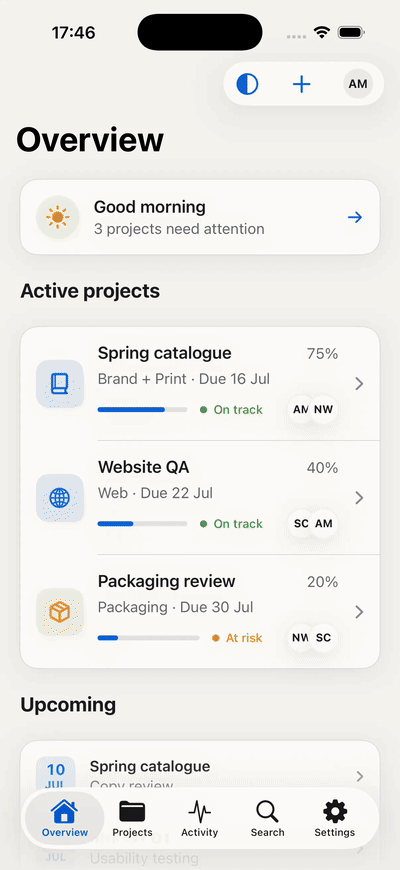
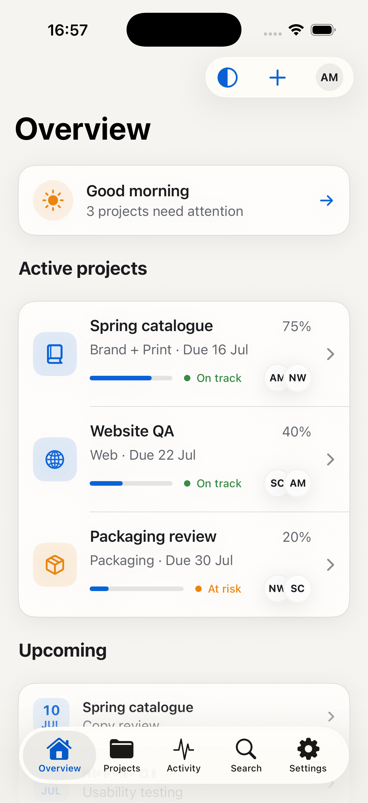
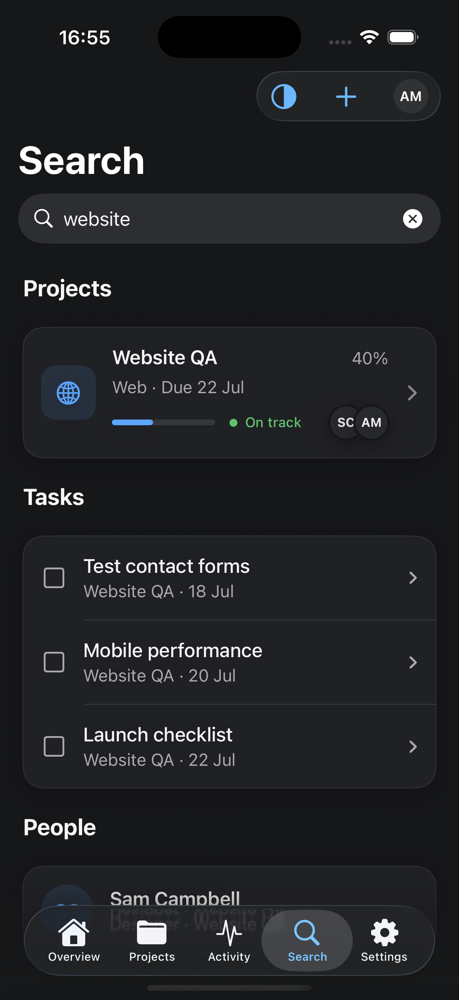
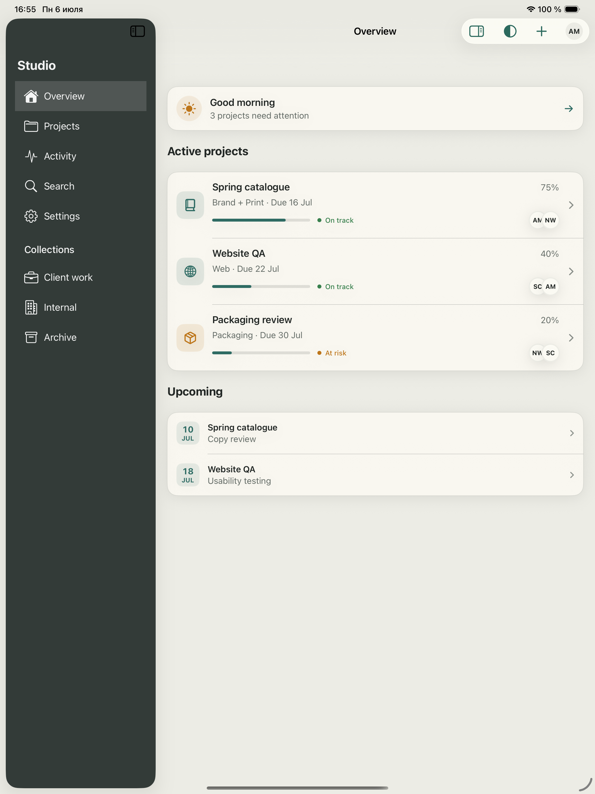
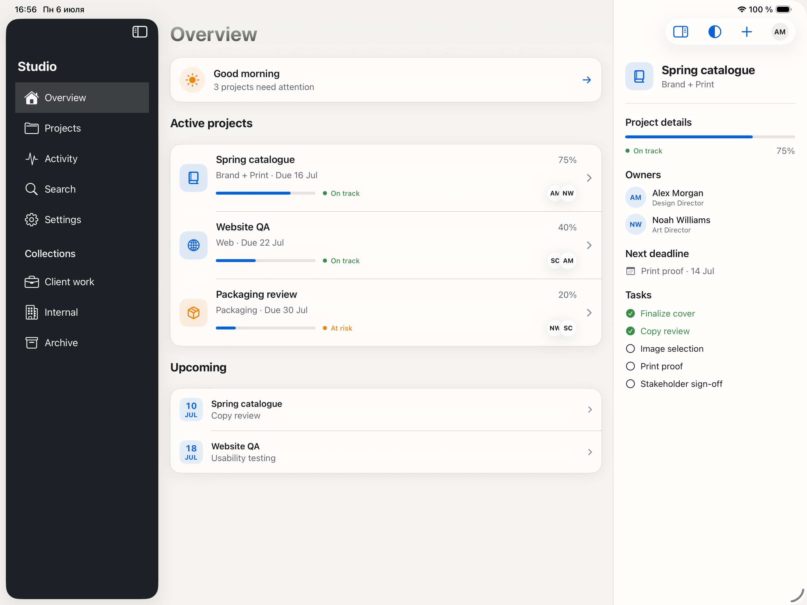

# Adaptive App Shell

A production-oriented SwiftUI shell that uses bottom tabs on iPhone and a sidebar with an optional inspector on iPad while preserving the same navigation state.

[](https://www.swift.org)
[](https://developer.apple.com/ios/)
[](https://github.com/mikonyaa/AdaptiveAppShell/actions/workflows/ci.yml)
[](LICENSE)

Part of the [Apple Design Templates](https://github.com/mikonyaa/Apple-Design-Templates) collection.



## Simulator screenshots

| iPhone · Classic | iPhone · Graphite Search |
| --- | --- |
|  |  |

| iPad · Stone | iPad · Classic with Inspector |
| --- | --- |
|  |  |

## What this solves

- System `TabView` navigation in compact width
- `NavigationSplitView` sidebar in regular width
- Optional contextual inspector without duplicating feature state
- Independent `NavigationStack` path for every destination
- Sidebar-only collections that do not overload the iPhone tab bar
- Enum-based routes that support deep links and state restoration
- Native Liquid Glass system chrome on iOS 26
- Opaque, readable fallback chrome on iOS 17–25
- Dynamic Type, VoiceOver, Increase Contrast, and Reduce Transparency support
- Three semantic, gradient-free themes: Classic, Graphite, and Stone

The package contains the reusable shell only. The studio workspace in `Examples` demonstrates integration without leaking demo models into the library.

## Requirements

- Xcode 26 or newer
- Swift 6
- iOS 17 or newer
- macOS 14 or newer for package consumers

The source supports iOS 17, but Xcode 26 is required to compile the guarded iOS 26 Liquid Glass APIs.

## Run the demo

Open:

```text
Examples/AdaptiveShellDemo/AdaptiveShellDemo.xcodeproj
```

Select the `AdaptiveShellDemo` scheme and run on an iPhone or iPad simulator.

## Installation

Add the package in Xcode using its GitHub URL, or declare it in `Package.swift`:

```swift
.package(
    url: "https://github.com/mikonyaa/AdaptiveAppShell.git",
    from: "1.0.0"
)
```

Then add `AdaptiveAppShell` to the application target.

For local development, choose **Add Local Package** and select this directory.

## Minimal integration

```swift
import AdaptiveAppShell
import SwiftUI

enum AppTab: Hashable, Sendable {
    case home
    case library
    case settings
}

enum AppRoute: Hashable, Sendable {
    case detail(String)
}

struct RootView: View {
    @State private var shellState = AdaptiveShellState<AppTab, AppRoute>(
        selection: .home
    )

    private let sections: [AdaptiveShellSection<AppTab>] = [
        AdaptiveShellSection(
            id: "main",
            items: [
                AdaptiveShellItem(
                    id: .home,
                    title: "Home",
                    systemImage: "house",
                    selectedSystemImage: "house.fill"
                ),
                AdaptiveShellItem(
                    id: .library,
                    title: "Library",
                    systemImage: "books.vertical",
                    selectedSystemImage: "books.vertical.fill"
                ),
                AdaptiveShellItem(
                    id: .settings,
                    title: "Settings",
                    systemImage: "gearshape"
                )
            ]
        )
    ]

    var body: some View {
        AdaptiveAppShell(
            title: "My App",
            sections: sections,
            state: shellState,
            content: { item, navigation in
                switch item.id {
                case .home:
                    HomeView {
                        navigation.push(.detail("welcome"))
                    }
                case .library:
                    LibraryView()
                case .settings:
                    SettingsView()
                }
            },
            destination: { route in
                switch route {
                case .detail(let id):
                    DetailView(id: id)
                }
            }
        )
        .adaptiveShellTheme(.classic)
    }
}
```

Use two to five items with `.tab` compact placement. Extra regular-width destinations belong in sidebar sections with `.hidden` compact placement.

## Inspector integration

Use the full initializer when selected content benefits from a regular-width inspector:

```swift
AdaptiveAppShell(
    title: "My App",
    sections: sections,
    state: shellState,
    showsInspector: { item in item.id == .library },
    content: { item, navigation in
        content(for: item, navigation: navigation)
    },
    destination: destination,
    inspector: { item in
        InspectorView(selection: item.id)
    }
)
```

The inspector starts closed so the sidebar remains available in portrait iPad layouts. The user controls it from the system toolbar.

## Themes

Themes expose semantic tokens instead of hard-coded view colors:

```swift
.adaptiveShellTheme(.graphite)
```

Create a custom theme by initializing `AdaptiveShellTheme`. No theme uses a gradient. Content surfaces remain opaque; Liquid Glass is reserved for system navigation and interactive controls.

## Project structure

```text
AdaptiveAppShell/
├── Sources/AdaptiveAppShell/       Reusable package
├── Tests/AdaptiveAppShellTests/    State and model tests
├── Examples/AdaptiveShellDemo/     iPhone and iPad demo app
├── Docs/                           Architecture and integration guides
├── Design/Mockups/                 Approved visual references
├── Assets/                         Simulator screenshots and GIF
└── Scripts/                        Reproducible showcase capture
```

## Documentation

- [Getting started](Docs/GettingStarted.md)
- [Architecture](Docs/Architecture.md)
- [Customization](Docs/Customization.md)
- [Accessibility](Docs/Accessibility.md)
- [Template quality checklist](Docs/QualityChecklist.md)
- [Beginner AI learning prompt](Docs/LearningPrompt.md)

## Verification

```bash
swift test

xcodebuild \
  -project Examples/AdaptiveShellDemo/AdaptiveShellDemo.xcodeproj \
  -scheme AdaptiveShellDemo \
  -destination 'generic/platform=iOS Simulator' \
  CODE_SIGNING_ALLOWED=NO \
  build
```

## License

MIT. See [LICENSE](LICENSE).
